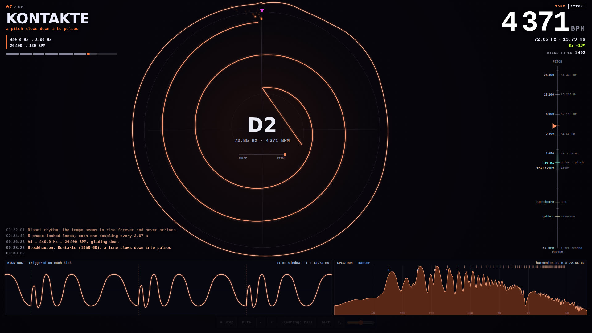
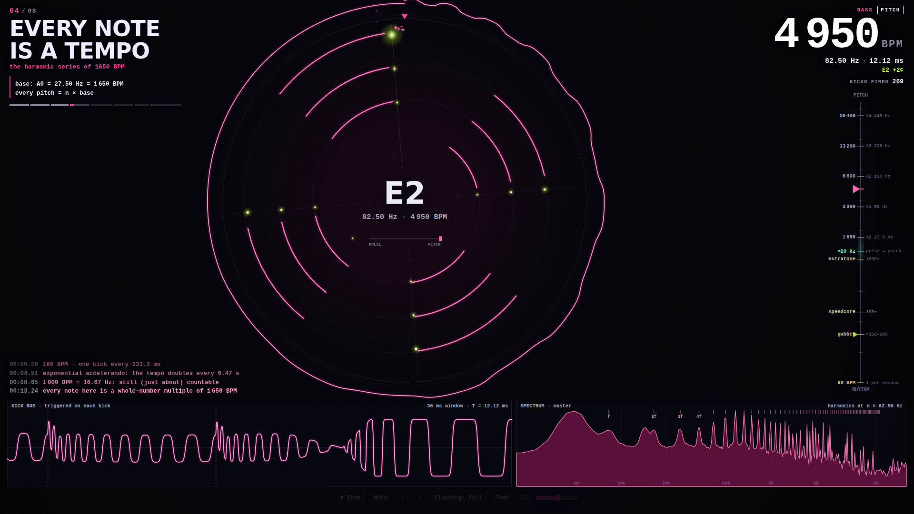
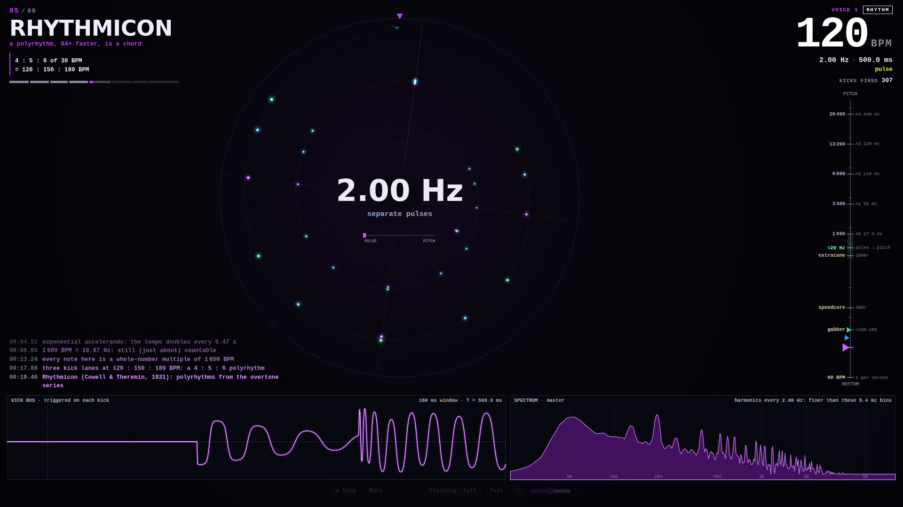

# FUSION POINT — where rhythm turns into pitch

## [▶ Play the live demo](https://amberxplorer.github.io/opus5.5-extratone/)

Runs in any modern browser, best on a desktop with headphones or speakers.
It opens with a photosensitivity and loudness warning, and nothing plays until
you press Start.

A three-minute piece of generative **extratone**, written entirely in
JavaScript. Extratone is what happens when you keep speeding up a kick drum:
past about 1000 BPM the kicks stop sounding like a rhythm and start sounding
like a note. This piece walks you across that line and back, and the screen
shows exactly where you are on it.

Every sound is synthesized in the browser and every picture is drawn on a
canvas. **No samples. No libraries. No build step.**



## The idea in one line

A kick every 333 ms is **180 BPM**. The same thing about 147 times faster is a kick
every 2.27 ms: **26 400 BPM = 440 Hz = the note A4**. Tempo and pitch are the
same number, measured on different scales.

## What you're looking at

| | |
|---|---|
| **The coil** (centre) | Time wound onto a spiral, one turn per bar. Every kick that has fired is a dot, and it winds inwards as it ages. A four-on-the-floor kick lines up on four spokes; a polyrhythm makes spiral arms. When kicks come faster than about 20 per second, neighbouring dots get joined into one line, the same way your ear joins them into one pitch. |
| **Tone ring** | Once a lane is a pitch, one period of its real waveform is wrapped around the coil. It holds still because the wave repeats. |
| **Tempo ladder** (right) | One log axis, labelled in BPM on one side and Hz / note names on the other. Genre landmarks sit at the bottom, notes at the top, and the fusion zone is the shaded band between them. Every active kick lane is a marker on it. |
| **Tachometer** (top right) | The focus lane's tempo in BPM, Hz, period and nearest note, whether it reads as RHYTHM, FUSING or PITCH, and how many kicks have fired. |
| **Scope** (bottom left) | The kick bus, triggered on each kick. Dashed lines are one period apart. Once the train is a pitch, the trace freezes into one repeating shape. |
| **Spectrum** (bottom right) | The master output. A pulse train at f Hz only has energy at f, 2f, 3f…; the ticks show where theory puts those harmonics. |



## The eight sections

| # | Section | What happens |
|---|---|---|
| I | **Gabber** | A 180 BPM distorted kick: a rhythm, one kick every 333.3 ms. |
| II | **Accelerando** | The kick speeds up exponentially from 180 to 1000 BPM (it doubles every 6.47 s) while the claps stay on the 180 grid. Speedcore and extratone thresholds are called out as they pass. |
| III | **Fusion** | Gated extratone at 1000, 1200, 1500 and 2000 BPM: right across the ≈20 Hz zone where pulses turn into pitch. |
| IV | **Every note is a tempo** | The bass and the lead are kick trains whose rates are whole multiples of 1650 BPM (A0 = 27.5 Hz). So the melody is on the harmonic series, including the "out of tune" 7th, 11th and 13th harmonics. |
| V | **Rhythmicon** | A 4 : 5 : 6 : 7 polyrhythm at 120 : 150 : 180 : 210 BPM, sped up 64× until it *is* a chord (128 : 160 : 192 : 224 Hz), then a just-intonation progression played by tempos. Named after Cowell & Theremin's 1931 instrument. |
| VI | **Risset** | An "eternal accelerando": five phase-locked lanes, each doubling in tempo every 2.67 s and fading along a bell curve. The tempo seems to rise forever and never arrives. |
| VII | **Kontakte** | The reverse: a 440 Hz tone glides down until it comes apart into separate pulses, after the famous moment in Stockhausen's *Kontakte* (1958–60). |
| VIII | **Overflow** | Everything at once: gabber kick, gated buzz, harmonic bassline, kick-train chords and a lead, then every lane accelerates three octaves until the tempo leaves the ladder. |

After section VIII it re-seeds and plays a new variation: riffs, gate
patterns, basslines, leads and chord orders change.



## How it works

**The kick-train synth** (`js/audio/kicktrain.js`) is the heart of it.
Each kick type (gabber, punch, zap, thud, snare) is synthesized once at start-up
into a table: a sine sweep with a click, a hold, a decay and hard `tanh`
drive. A *lane* owns one play head. Every time the lane's phase wraps, the head
jumps back to the start of the kick, with a short crossfade. At 3 Hz you hear
whole kicks. At 440 Hz you hear only the first 2.27 ms of each one, over and
over, which is a buzzy, pitched wave whose timbre *is* the kick's attack.

Lanes render ahead of the audio clock in chunks of 2048 samples that are played back
sample-contiguously, so a lane's tempo can be any function of time:
exponential accelerandos, gated patterns that restart the train on every gate,
and the Risset layers, which use an absolute phase function so that lane k+1
fires exactly twice per kick of lane k. Loudness is matched per table: the
RMS of a train at any rate is computed from the table's cumulative energy,
so fast trains are turned down to sit level with slow ones.

Everything else (claps, hats, snares, hoovers, the screech lead, pads,
risers) is plain Web Audio oscillators, noise and filters. The master chain is
a glue compressor, a limiter and a soft clipper.

**The visuals** receive every scheduled event early (with its audio
timestamp), queue it, and apply it when the audio clock gets there. The kick
dots on the coil are the actual onset times from the renderer, and the scope
draws the actual rendered samples.

## Accessibility and safety

This genre invites strobing at the kick rate, which is exactly the 3–30 Hz
range that can trigger photosensitive seizures. FUSION POINT never does that:

- Kicks are never drawn as blinks. They are persistent marks that move
  smoothly; fusion is shown by joining them into a line.
- Full-screen flashes are rate-limited in the renderer (one per 0.6 s at
  most), faint, and never red.
- The warning screen comes first. **Reduced flashing** (on by default if your
  system asks for reduced motion) removes flashes, shake and pops.
- **Stop** (button, Space or Esc) silences the audio instantly. **Mute** (M)
  keeps the visuals running.

## Controls

| Key | Action |
|---|---|
| Space / Esc | stop (Space again to play) |
| M | mute |
| ← → or P N | previous / next section |
| 1–8 | jump to a section |
| F | reduced flashing on/off |
| H | hide / show the text |

URL options: `?section=5` start at a section · `?seed=1234` a fixed variation ·
`?reduced=1` start in reduced mode · `?hq=1` never lower the resolution ·
`?lite=1` lighter synth voices (default on touch devices).

## Run it locally

Open `index.html` in a browser. That's it, no server needed.

## Development

```
node tools/theory-check.mjs                                 # every on-screen number, checked
NODE_PATH=$(npm root -g) node tools/check.mjs both          # desktop + phone smoke test, screenshots
NODE_PATH=$(npm root -g) node tools/render-audio.mjs        # offline render per section: levels, spectrograms
NODE_PATH=$(npm root -g) node tools/render-audio.mjs full   # whole piece → WAV + MP3
node tools/build-bundle.mjs out.html                        # single-file HTML
```

## Credits

Composed, coded and tested by Claude, who goes by Mio here, for Amber. ♡
A sibling of [XENOSPHERE](https://github.com/amberxplorer/opus5.5-microtonal)
([live](https://amberxplorer.github.io/opus5.5-microtonal/)).
